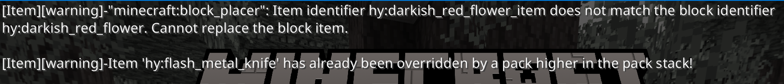
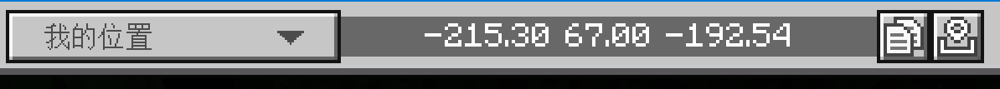

# Prologue.3 开发工具与相关资源

正所谓「工欲善其事，必先利其器」，在开始正式开始制作附加包之前，要了解一下我们制作附加包所需要的工具以及一些实用资源。

## Minecraft 基岩版

附加包是服务于 Minecraft 基岩版的，如果我们没有 Minecraft 基岩版，那么一切创造出来的美好事物都将会想空中楼阁一样脆弱。

关于如何下载 Minecraft 基岩版，这里不再赘述，请自行查阅相关资料。

## 文本编辑器

附加包可以使用任何文本编辑器进行编辑，甚至直接用记事本写也可以（但非常不推荐）！

为了开发的方便，我们推荐使用以下编辑器：

- [Microsoft VS Code](https://code.visualstudio.com/)：一款由微软出品的开源跨平台代码编辑器；
- [Bridge](https://bridge-core.app)：一款专为 Minecraft 附加包提供的IDE（集成开发环境）；
- [MT管理器](https://mt2.cn/)：一款Android 平台文件管理器，内置简单的代码编辑功能与压缩功能；
- [ES文件浏览器](http://www.estrongs.com/?lang=zh-CN)。

选择一款好的文本编辑器可以使我们在编辑 JSON 文件、尤其是在编写体量较大的 JSON 文件（比如交易表）时更加游刃有余，而假如你一意孤行要用记事本编写附加包，那么……祝你好运( • ̀ω•́ )

> 如果选用 Microsoft VS Code，建议安装以下插件使开发更轻松：
> - [Chinese (Simplified) Language Pack for Visual Studio Code](https://marketplace.visualstudio.com/items?itemName=MS-CEINTL.vscode-language-pack-zh-hans)：中文语言包，如果能看懂英文可以跳过；
> - [Blockception's Minecraft Bedrock Development](https://marketplace.visualstudio.com/items?itemName=BlockceptionLtd.blockceptionvscodeminecraftbedrockdevelopmentextension)：**强烈推荐！** 这个插件可以为我们附加包中的`.mcfunction`、`.json`以及`.lang`文件提供语法高亮、自动补全等功能；
> - [.mcfunction support](https://marketplace.visualstudio.com/items?itemName=arcensoth.language-mcfunction)；
> - [.lang support](https://marketplace.visualstudio.com/items?itemName=zz5840.minecraft-lang-colorizer)；
> - [Bedrock Definitions](https://marketplace.visualstudio.com/items?itemName=destruc7i0n.vscode-bedrock-definitions)；
> - [Snowstorm Particle Editor](https://marketplace.visualstudio.com/items?itemName=JannisX11.snowstorm)；
> - [UUID Generator](https://marketplace.visualstudio.com/items?itemName=netcorext.uuid-generator)：自动生成 UUID 的插件。

## 图像处理程序

在开发过程中，我们可能需要用到一些纹理资源，因此我们需要一款图像处理软件来绘制这些纹理：

- PC：PhotoShop、GIMP、Pixelorama；
- Android：IsoPix；
- iOS：Pixelmator。

## 压缩软件

附加包制作完成后，我们需要将附加包压缩成压缩文件以供发布，因此我们需要一款压缩软件：

- PC：7Zip、WinRAR；
- Android：MT管理器；
- iOS：ES文件浏览器。

## 游戏内工具

有一些调试工具是游戏内置的，我们无需单独下载，但需要掌握其使用方法。

### 内容日志

在附加包的工作过程中，Minecraft 会在**内容日志（Content Log）** 中记录相关信息，其中一些信息只是记录正常的游戏操作，而有些则是一些错误信息[^1]。

使用内容日志可以帮助我们快速找到附加包问题的源头，从而减轻工作量，我们可以通过下面的方式开启内容日志：

1. 进入游戏设置/创建者；
2. 将「内容日志设置」下的三个选项全部启用。

接下来，我们就可以在屏幕上方看到内容日志了：

在游戏设置/创建者/内容日志设置/内容日志历史中，我们可以查看过去的内容日志。

过去的内容日志一般会被保存在下面的位置：

- **Windows UWP**：`%LocalAppData%\Packages\Microsoft.MinecraftUWP_8wekyb3d8bbwe`；
- **Android** ：`*root storage location*/games/com.mojang/logs`；
- **iOS** ：`*root storage location*/Minecraft/game/com.mojang/logs`

### 查看与复制坐标

我们可以通过下面的步骤开启查看与复制坐标的功能：

1. 进入游戏设置/创建者；
2. 将「启用复制坐标UI」选项启用。

接下来，我们就可以通过聊天栏上方来获取并复制当前/方块坐标了：

## 原版附加包

Minecraft 中的一些原版游戏内容就是基于附加包实现的，而 Mojang 则为基岩版开发者提供了原版的附加包范例，通过这些范例，我们可以轻松的获取一些原版的资源：

- [Bedrock Dev](https://bedrock.dev/zh/packs)：提供了比较全的原版附加包模板，1.19.40.24 前的版本均可以直接下载；
- [Github](https://github.com/Mojang/bedrock-samples)：这里有官方提供的原版附加包模板，然而 Github 可能在部分地区无法访问。

## 开发文档、教程和博文

在网络上散落着许多关于附加包开发的教程和博文，我们可以自行查阅。

本书的[附录](../appendix/documents.md)中列出了许多有用的资源，包括官方文档、教程和博文等。

## 小结

在安装了对应平台的开发工具，并且了解了游戏内置的开发工具后，我们的开发之旅就可以正式开始了。

[^1]: [Content Error Log - Microsoft Learn](https://learn.microsoft.com/en-us/minecraft/creator/documents/contenterrorlog?view=minecraft-bedrock-stable)
