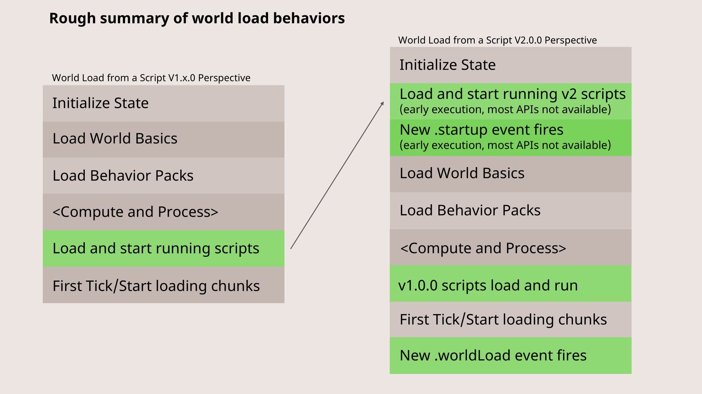

# 脚本 V2

> [!INFO]
> 本文译自[Microsoft Learn](https://learn.microsoft.com/en-us/minecraft/creator/)，按照 CC BY 4.0 协议进行许可

通常来说，当你听说自己喜爱的软件推出「2.0 版本」时，都会感到格外兴奋：全新的体验！一切都会变得不同，而且有望变得更好！

但关于脚本 API v2.0.0，你首先要明白的一点是：**它和 1.X 的脚本接口并没有那么大的区别**。当然，我们对脚本 API v2.0.0 带来的底层架构改进同样感到兴奋，但我们也希望你能认同，它并没有和旧版**完全脱节**。

脚本版本的设计**遵循语义化版本（SemVer）规则与规范**。只要某次版本更新会破坏向后兼容性，主版本号就必须提升。这正是脚本 API v2 的意义所在：它修复并优化了一批 API 结构上的问题，但**如果将面向 v1.0.0 编写的现有代码直接升级到 v2.0.0，代码可能会无法运行**。我们会定期推出新版脚本系统，用于修复与改进功能，但这些新版也可能无法严格保持与当前 API「约定」的向后兼容。

因此，你可以预期脚本 API 会不断出现主版本级的跃升——例如，脚本 API 3.0.0 或许在不久的将来就会到来。

只要你在 `manifest.json` 中声明目标为《我的世界》API 1.X，**所有基于 v1.0.0 编写的现有脚本与内容都将继续正常运行**。这些内容在未来多年内都会继续得到官方支持。它们会在最大化兼容 v1.0.0 语义的环境中运行，你不需要对脚本做任何修改。

话虽如此，将新项目或正在开发的项目迁移到更现代化的脚本 2.0.0 环境会更有优势，尤其是在推出仅支持 2.0.0 的新 API 之后。

下面介绍脚本 API 2.0 的主要变更。

### 脚本环境更早执行与加载
在脚本 1.X 环境中，只会在游戏加载完一部分底层基础内容（如实体定义等）之后，才会在存档中加载脚本。

即便如此，在脚本 1.0.0 中，脚本逻辑的首次执行通常也会在**第一个区块加载之前**就发生，因此环境仍处于半加载状态。开发者通常需要等到流程更靠后的阶段——比如若干刻之后、玩家加入后、或方块可用后——再去执行附加包真正的初始化逻辑。



在 2.X 中，脚本初始化与首次执行的时机被**大幅提前**，放在了世界启动与加载的更早阶段。绝大多数 API（哪怕是像获取世界游戏模式这类简单的属性查询）在此时都还无法调用。做出这一改动，是为了让脚本能在更多内容加载之前，就参与配置服务器与世界的初始化流程。

为了让行为更可预测，我们为 API 增加了更多保护机制，防止它们在未加载状态下被调用（即早期执行权限控制）。同时我们也对事件进行了一系列更新（新增 `worldLoad` 事件与全新的 `startup` 事件），让你可以在所有内容完全加载后再运行代码。

### Promise 决议机制变更

在脚本 2.X 中，Promise 现在可以在每刻末尾刷新延迟执行队列与异步函数时，**与后事件、系统任务同步决议**。而在旧版脚本中，Promise 只会在每刻末尾决议一次。这一改动让 Promise 能更频繁、更及时地在等待操作完成后立即决议。

此外，早期执行阶段也会决议一次 Promise，以确保异步导入能在早期执行结束前完成。

#### 脚本 2.X 刷新顺序
在脚本 1.X 中，系统会在每刻末尾持续刷新后事件与系统任务，直到脚本监控器超时或无剩余任务可刷新。而在脚本 2.X 中，Promise 决议也会被持续刷新。Promise 会在刷新阶段独立决议，也会在每次执行完一类后置事件、每个系统任务后立即决议。


总体来说，v1 与 v2 脚本的新刷新顺序如下：

- v1 Promise 在每刻末尾**仅决议一次**
- 持续刷新直到无任务需要执行
  - 决议 v2 Promise
  - 运行系统任务（v1 / v2）
    - 每个任务执行后，决议 v2 Promise
  - 运行后置事件（v1 / v2）
    - 每类事件执行后，决议 v2 Promise

#### 示例
```typescript
new Promise<void>(resolve => {
    resolve();
}).then(_ => {
    console.error('Promise 已决议');
});
```

在 v1 中，上面的代码会在下一刻输出日志。在 v2 中，Promise 会在**同一刻内刷新**，意味着它会在当前刻就输出日志。

```typescript
await system.waitTicks(1);
await system.waitTicks(0); // v1 中无法实现
```

2.X 还新增了一项能力：可以使用 `waitTicks` 等待 0 刻。在 1.X 中，由于 Promise 要到下一刻才会决议，无法等待 0 刻。现在 Promise 会被即时刷新，因此可以等待 0 刻并在当前刻执行。

### 其他 API 层面变更
除了脚本加载与 Promise 决议的底层改动外，多个 API 也发生了变化。查看变更的最佳方式，是在项目中使用 `2.0.0-beta` 版 TypeScript 类型定义（例如执行 `npm i @minecraft/server@2.0.0-beta`），并在代码编辑器中观察变化。

- `Entity`：
  - `applyKnockback` 方法在 2.0.0 中现在接收一个 `VectorXZ` 参数作为击退水平力（包含强度/大小），以及一个垂直强度参数。从 v1 迁移时，你需要将旧方向向量标准化，并乘以旧水平强度值。垂直强度与之前一致。
- `Dimension`：
  - 移除了 `runCommandAsync`，因为大多数命令实际上并非异步执行。如果你需要异步运行函数，可以研究通过 `System.runJob` 使用任务系统。
- `Entity Components`：
  - 如果实体无效，`getComponents`、`getComponent`、`hasComponent` 现在会抛出错误
  - 如果底层实体无效，`EntityComponent.getEntity` 会抛出错误（旧版返回 undefined）
  - 如果底层实体无效，`EntityInventoryComponent.container` 属性会抛出错误（旧版返回 undefined）
- 各类的 `isValid` 方法已改为**只读属性**
- `EffectType`
  - getName 方法现在会始终返回带 `minecraft:` 命名空间前缀的名称
- `Effect`
  - typeId 属性现在会始终返回带 `minecraft:` 命名空间前缀的名称
- `minecraft:air` 物品已被移除（但它仍然是合法方块）

### 自定义组件 v2
「自定义组件 v2」是一项新的功能，启用后：

- `minecraft:custom_components`被废弃，改用扁平化自定义组件
- 自定义组件现在支持参数

#### 扁平化
在旧版自定义组件中，组件必须写在 `minecraft:custom_components` 内部。现在不再需要这一层，`minecraft:custom_components` 已被废弃。你可以像编写其他原生组件一样直接书写自定义组件。例如：

```json
{
    "components": {
        "minecraft:loot": "...",
        "minecraft:collision_box": {
            "enabled": true
        },
        "my_custom_component:name": {},
        "my_custom_component:another_component": {}
    }
}
```

#### 参数
除了在 JSON 中扁平化书写组件外，你还可以为组件传入参数。自定义组件的脚本绑定已升级，支持第二个参数 `CustomComponentParameters`，可读取组件的 JSON 参数列表。下面示例展示如何在脚本中使用自定义组件参数：

```json
{
    "components": {
        "some_component:name": {
            "first": "hello",
            "second": 4,
            "third": [
                "test",
                "example"
            ]
        }
    }
}
```

```typescript
type SomeComponentParams = {
    first?: string;
    second?: number;
    third?: string[];
};

system.beforeEvents.startup.subscribe(init => {
    init.blockComponentRegistry.registerCustomComponent('some_component:name', {
        onStepOn: (e : BlockComponentStepOnEvent, p : CustomComponentParameters) => {
            let params = p.params as SomeComponentParams;
            ...
        }
    });
});
```

## 升级到脚本 2.X
#### 启动事件
`world.afterEvents.worldInitialize` 应改为 `world.afterEvents.worldLoad`，无需其他改动。该事件在脚本 2.X 中已重命名。

`world.beforeEvents.worldInitialize` 应改为 `system.beforeEvents.startup`。`worldInitialize`前事件已被移除，由全新的`startup`事件替代。

新的 `startup` 事件会在**早期执行阶段**运行。这意味着原本能在`worldInitialize`中运行的部分代码，在`startup`中将不再可用。诸如获取玩家、访问世界实体与方块等逻辑，应移至`world.afterEvents.worldLoad`事件中。

#### `world` 对象
早期执行带来的最大变化是：**在脚本环境的早期执行阶段调用大部分世界 API 都会报错**。订阅事件仍然可用，因为它不访问世界状态；但任何与世界状态、实体、方块、玩家交互的操作，都会被限制，直到第一刻开始。

#### 脚本启动流程
为保持向后兼容，脚本 v1.x.x 的启动时机与能力未做修改。v1.x.x 不使用早期执行，运行时机与现在完全一致。带脚本支持的服务器整体加载流程如下：

- v2 脚本加载并以**早期执行模式**运行
- v2 脚本的 Promise 在早期执行阶段决议
- v2 脚本在早期执行阶段收到 `system.beforeEvents.startup` 事件
- 等待世界加载完成、游戏启动……
- v1 脚本加载并运行
- v1 脚本收到 `world.beforeEvents.worldInitialize` 事件
- 第一游戏刻开始……
- 刻末尾，所有脚本收到 `world.afterEvents.worldLoad` 事件（v1 中仍叫 `worldInitialize`）

#### 早期执行阶段可用哪些 API？
以下是脚本 v2.0.0-beta 早期执行模式下初始可用的 API：

- `world.beforeEvents.*.subscribe`
- `world.beforeEvents.*.unsubscribe`
- `world.afterEvents.*.subscribe`
- `world.afterEvents.*.unsubscribe`
- `system.afterEvents.*.subscribe`
- `system.afterEvents.*.unsubscribe`
- `system.beforeEvents.*.subscribe`
- `system.beforeEvents.*.unsubscribe`
- `system.clearJob`
- `system.clearRun`
- `system.run`
- `system.runInterval`
- `system.runJob`
- `system.runTimeout`
- `system.waitTicks`
- `BlockComponentRegistry.registerCustomComponent`
- `ItemComponentRegistry.registerCustomComponent`

#### 脚本根上下文里无法在早期执行的代码该怎么办？

如果你的脚本根上下文中有调用了早期不可用 API 的代码，需要将其延迟到 `world.afterEvents.worldLoad` 事件期间或之后执行。

有多种组织代码的方式可以实现：使用类或函数可以帮助你封装各个系统的启动逻辑，并在事件回调中调用；也可以编写惰性 getter，只在调用时才访问 API 并缓存结果。

在大多数情况下，你只需要把「根上下文代码」包裹在 `world.afterEvents.worldLoad` 中即可。
